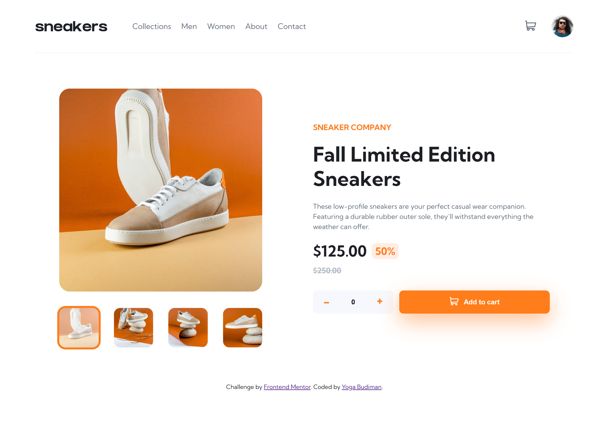
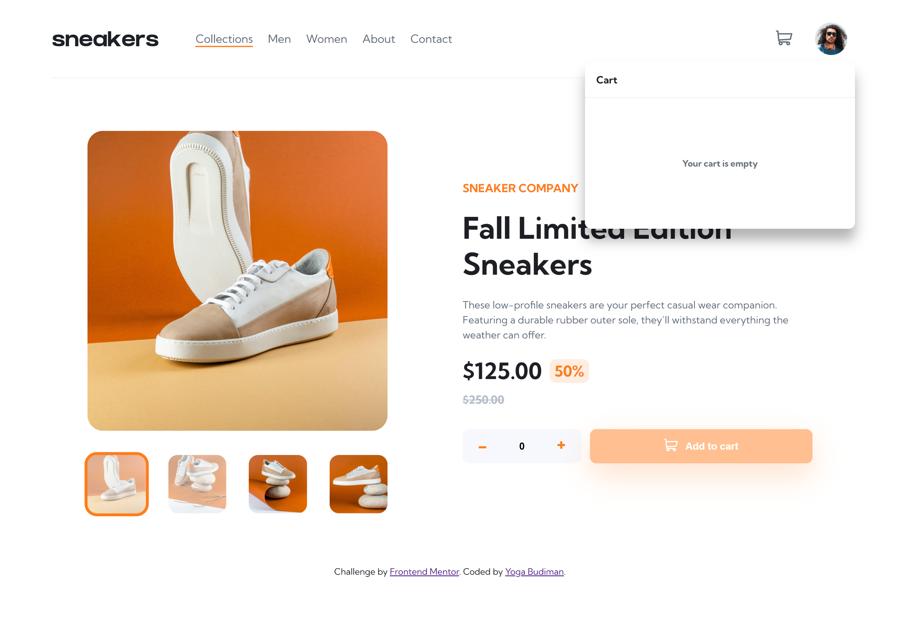
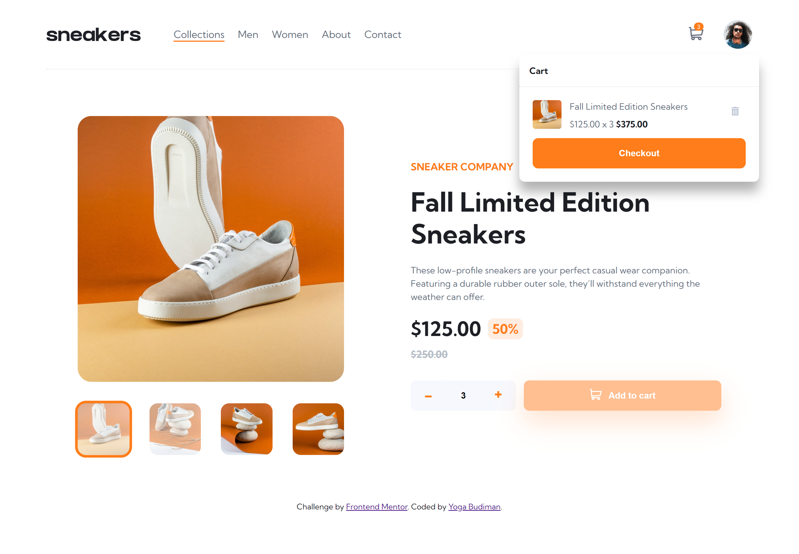
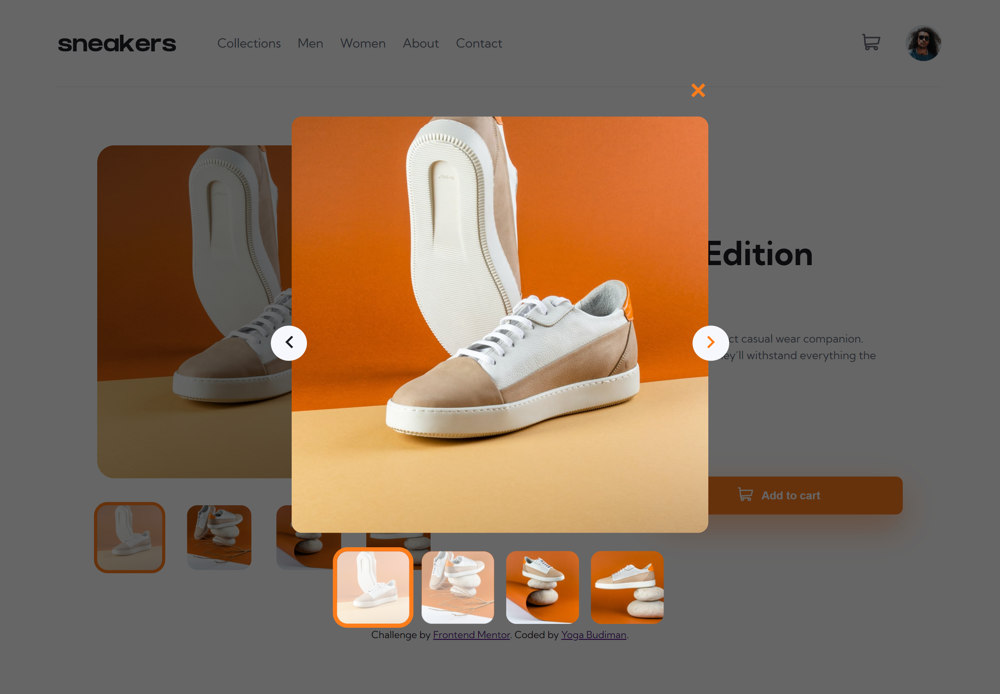
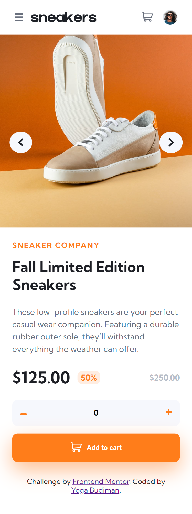
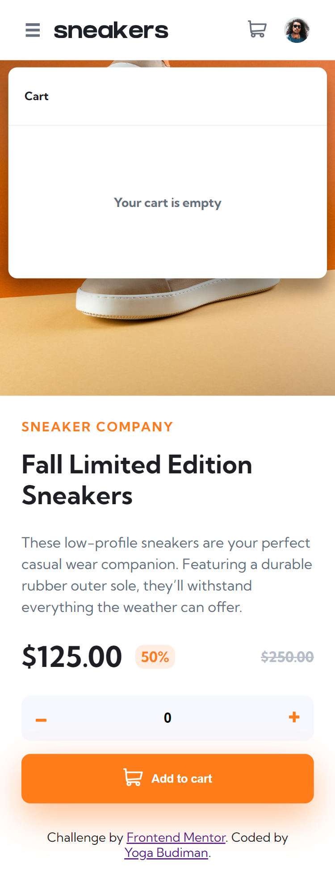
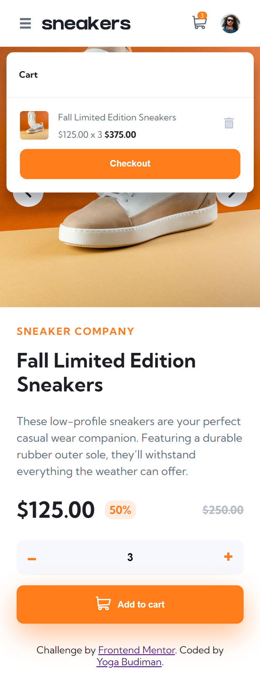
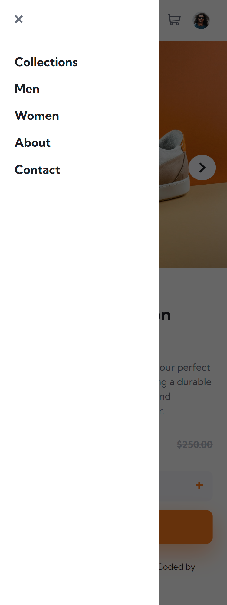

# Frontend Mentor - E-commerce product page solution

This is a solution to the [E-commerce product page challenge on Frontend Mentor](https://www.frontendmentor.io/challenges/ecommerce-product-page-UPsZ9MJp6). Frontend Mentor challenges help you improve your coding skills by building realistic projects.

## Table of contents

- [Overview](#overview)
  - [The challenge](#the-challenge)
  - [Screenshot](#screenshot)
  - [Links](#links)
- [My process](#my-process)
  - [Built with](#built-with)
  - [What I learned](#what-i-learned)
  - [Continued development](#continued-development)
  - [Useful resources](#useful-resources)
- [Author](#author)
- [Acknowledgments](#acknowledgments)

## Overview

### The challenge

Users should be able to:

- View the optimal layout for the site depending on their device's screen size
- See hover states for all interactive elements on the page
- Open a lightbox gallery by clicking on the large product image
- Switch the large product image by clicking on the small thumbnail images
- Add items to the cart
- View the cart and remove items from it

### Screenshot

### Links

- Solution URL: (https://github.com/ygabdn29/ecommerce-product-page)
- Live Site URL: (https://ygabdn29.github.io/ecommerce-product-page/)

## My process

### Built with

- HTML5 markup
- CSS
- Flexbox
- CSS Grid
- SASS / SCSS
- Vanilla Javascript

### What I learned

In this challenge I try to use SCSS to help me create the design. While this is the first time I'm using SCSS, I can see this tool being useful for larger scope of website development. In this challenge I also try to implement BEM methodolody to naming my markup classes.

### Continued development

- The hover states of navbar still need some works, tho I still don't know how. Maybe I'll visit again in the future once I learn new technique to fix the the issue.
- The solution I implemented to create lightbox and cart can still be improved. In fact I believe my solution is still too direct and inefficient. I'll visit again in the future.
- Adding more breakpoints so the design is more fluid accross multiple breakpoints.
- I believe my BEM naming skill still could be improved, but I guess it's something that goes with my time as it goes hand in hand with my marking up skill.

### Useful resources

- [MDN](https://developer.mozilla.org/en-US/)
- [CSSTricks](https://css-tricks.com/)
- [StackOverflow](https://stackoverflow.com/)

## Author

- Yoga Budiman

## Acknowledgments

- [Codepen.io](https://codepen.io/ChynoDeluxe/pen/poyNEay?editors=1010) - For the number input, I'm using Chyno Deluxe's codepen and modified so that it suited my need.
